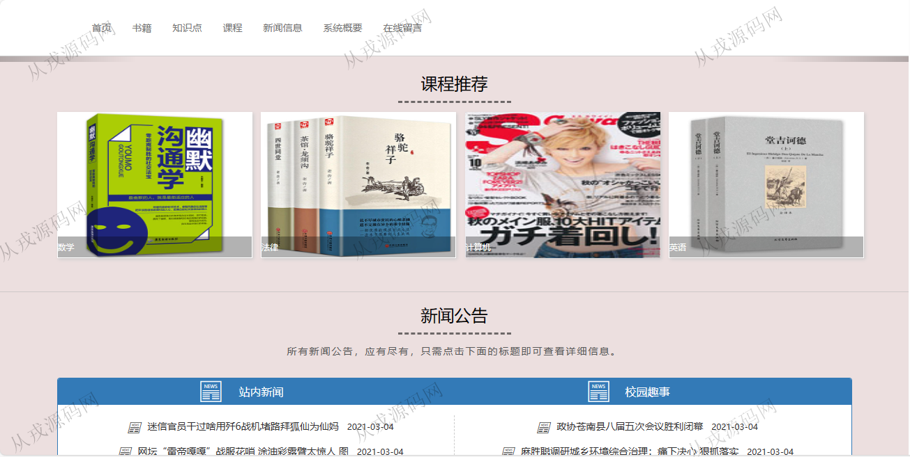
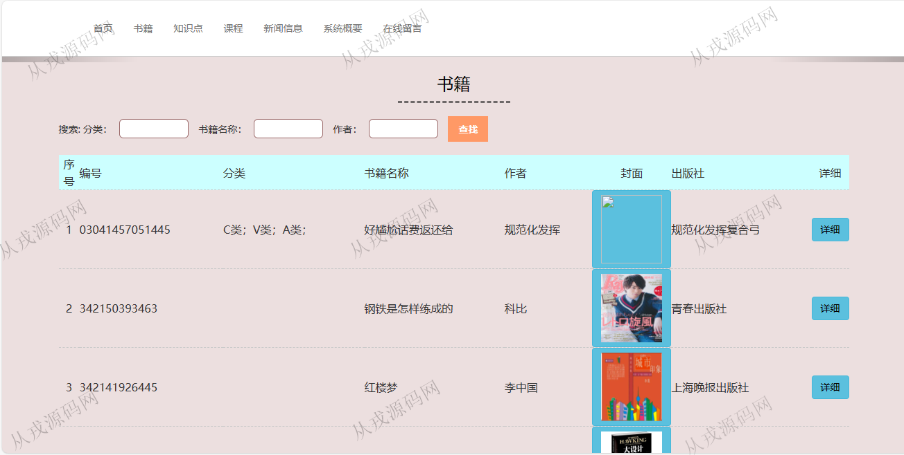
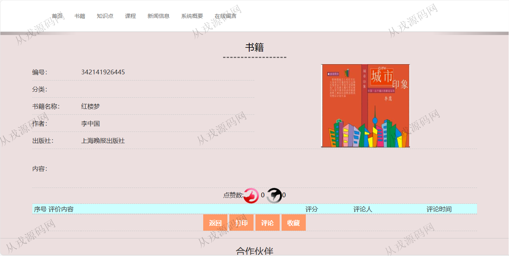
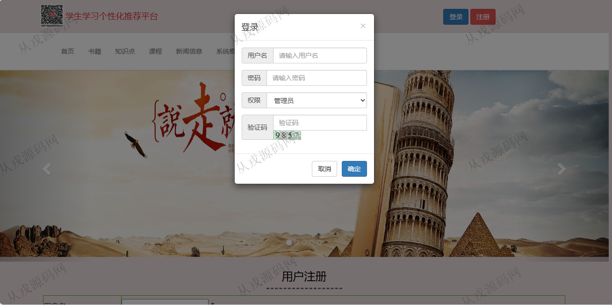
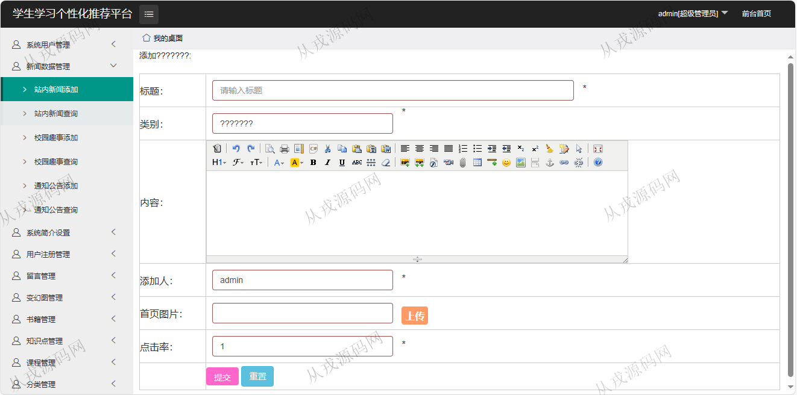
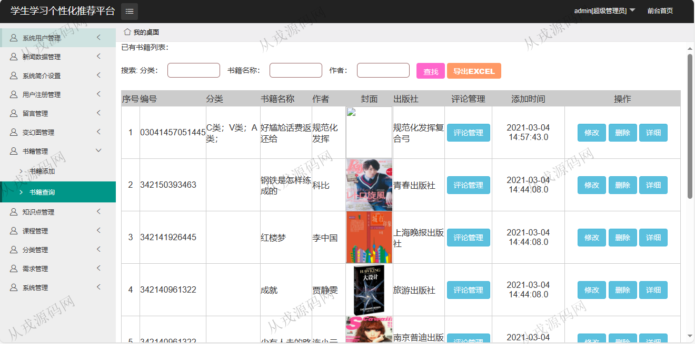
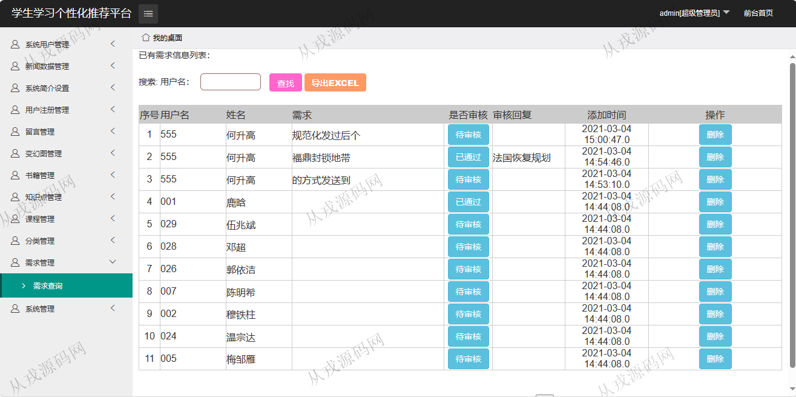
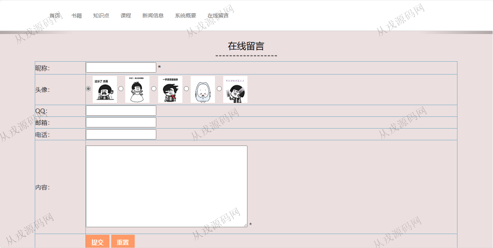

<h1 align="center">81.学生推荐平台管理系统</h1>

- <b>完整代码获取地址：从戎源码网 ([https://armycodes.com/](https://armycodes.com/))</b>
- <b>技术探讨、资料分享，请加QQ群：692619798</b> 
- <b>作者微信：19941326836  QQ：952045282</b> 
- <b>承接计算机毕业设计、Java毕业设计、Python毕业设计、深度学习、机器学习</b>
- <b>选题+开题报告+任务书+程序定制+安装调试+论文+答辩ppt 一条龙服务</b>
- <b>所有选题地址 ([https://github.com/YuLin-Coder/AllProjectCatalog](https://github.com/YuLin-Coder/AllProjectCatalog)) </b>

## 项目介绍
基于jsp+servlet的学生推荐平台管理系统：前端 jsp、jquery，后端 servlet、jdbc，集成用户端和管理后台，用户端浏览书籍课程，收藏和评论，管理端管理书籍知识点等功能于一体的系统。

## 功能介绍

### 管理员

- 系统用户管理：管理员用户列表查询，新增和删除，密码修改
- 站内新闻：站内新闻增删改查
- 校园趣事：校园趣事增删改查
- 通知公告：通知公告增删改查
- 系统简介设置：系统简介设置，关于我们设置，联系方式设置
- 用户注册管理：前台用户注册记录的修改，删除，审核
- 留言管理：留言列表，删除，回复
- 变幻图管理：变幻图的增删改查
- 书籍管理：书籍信息的增删改查
- 知识点管理：知识点信息的增删改查，多条件查询，导出
- 课程管理：课程信息的增删改查，导出，评论管理
- 分类管理：分类信息的增删改查
- 需求管理：需求信息的查询，删除，在线审核
- 系统管理：数据备份

### 用户

- 基本功能：登录、注册，退出
- 首页：导航栏，轮播图，课程推荐，新闻公告
- 书籍：书籍信息列表查询，书籍详情，评论，收藏
- 知识点：知识点信息列表查询，知识点详情，评论，收藏
- 课程：课程信息列表查询，课程详情，评论，收藏
- 留言：查看留言，在线留言

## 环境

- <b>IntelliJ IDEA 2009.3</b>

- <b>Mysql 5.7.26</b>

- <b>Tomcat 7.0.73</b>

- <b>JDK 1.8</b>

## 运行截图

